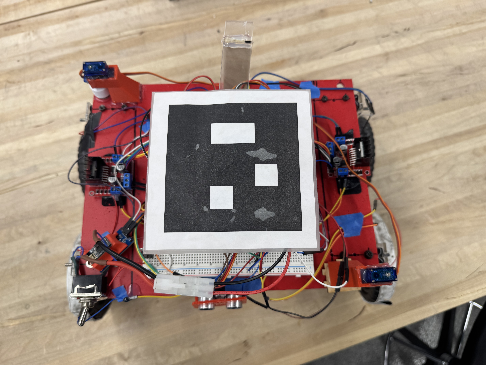
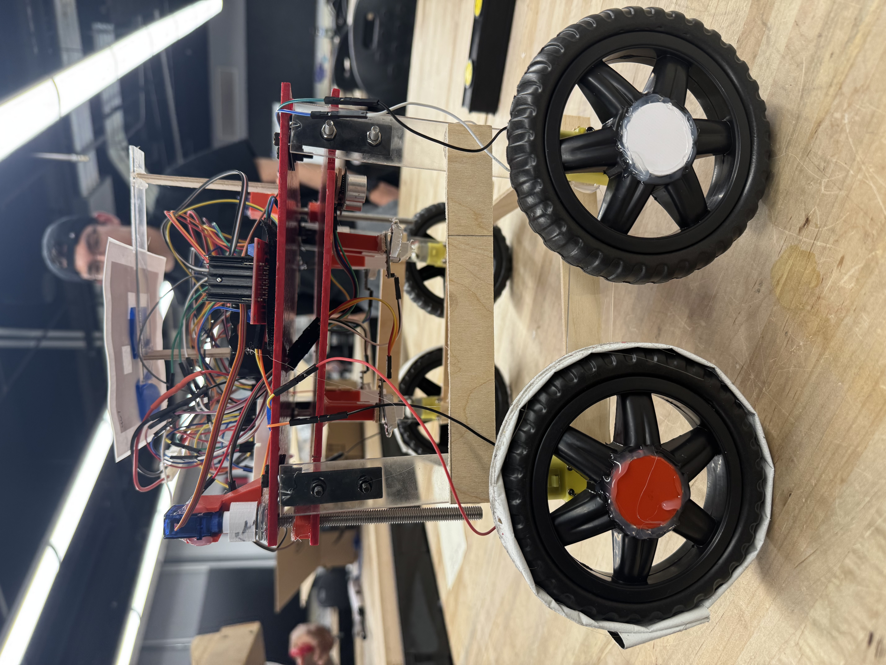
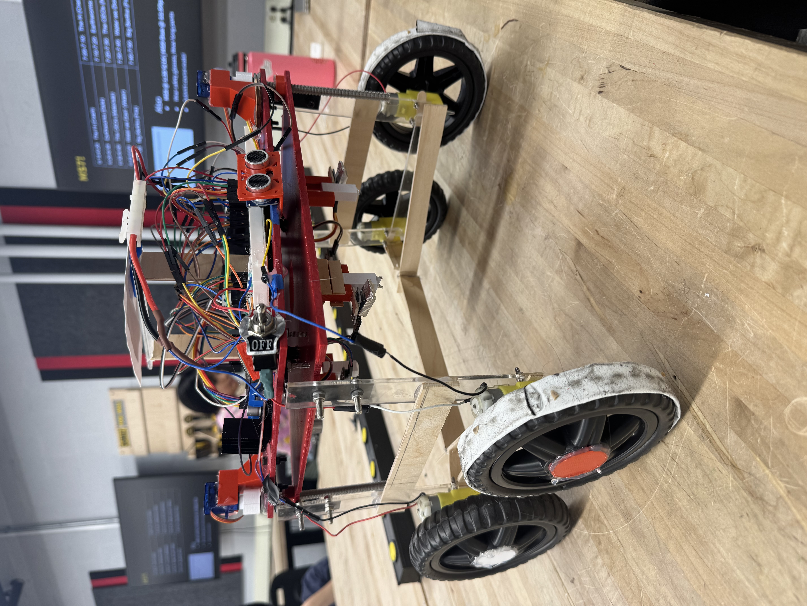

# 🔥 Fire Suppression Over Terrain Vehicle (OTV) 🚒🌲

<table>
  <tr>
    <td></td>
    <td></td>
    <td></td>
    <td></td></td>
  </tr>
</table>

> _An autonomous fire-fighting robot built for the debut Fire Suppression Challenge at the University of Maryland._

---

## 🏁 What is This?

The **Fire Suppression Over Terrain Vehicle (OTV)** was designed and built for the **first-ever Fire Suppression Challenge**, a mission introduced in the **ENES100: Engineering Design** course at the **University of Maryland**.

Teams were challenged to design autonomous vehicles that could detect and suppress real flames while traversing randomized terrain and completing precision-based tasks.

---

## 🎯 Challenge Objectives

✔️ Navigate within **150 mm** of the fire site  
✔️ Identify and **report fire orientation** (A, B, or C)  
✔️ Measure and **report number of active flames**  
✔️ Suppress **all flames except the middle one**  
✔️ Clear all **three terrain obstacles**  
✔️ Enter the **destination zone**

> Fires were represented using open-flame candles mounted in a variable-height pedestal, simulating post-impact electrical fires.

---

## 🔧 Our Vehicle Design

The OTV uses **DHT22 temperature sensors** to detect heat from candle flames. When fire is detected, a **servo-driven smothering plane** is deployed to extinguish it—no chemicals or water needed. An **Arduino MEGA** handles all sensing, logic, and actuation.

---

## ⚙️ Core Features

- 🌡️ **DHT22 Fire Detection**: Captures real-time temperature readings
- 🔁 **Servo-Controlled Smothering Plane**: Mechanically suppresses flames
- 🚗 **Obstacle Navigation**: Capable of terrain traversal
- 🧠 **Fully Autonomous Logic**: Programmed entirely on Arduino MEGA

---

## 🧰 Hardware Components

- **Arduino MEGA**
- **DHT22** temperature sensors
- Continuous rotation **servo motors**
- Custom-built **smothering plane mechanism**
- **Motor driver board** + drive motors
- **Rechargeable LiPo battery**
- Laser-cut and 3D-printed terrain-ready chassis

---

## 🧠 Software Overview

Written in Arduino C++, the program includes:

- Sensor polling from multiple DHT22s
- Flame detection using calibrated thresholds
- Servo actuation logic to lower the smothering plane
- Obstacle-aware navigation routines

---
